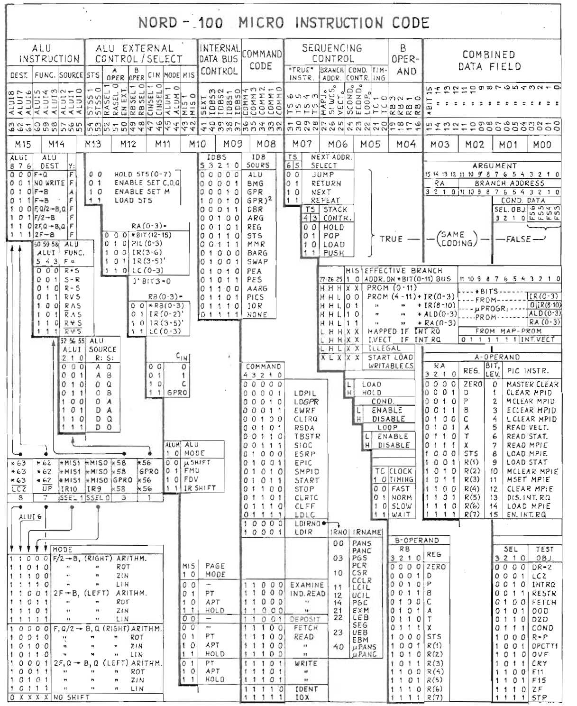
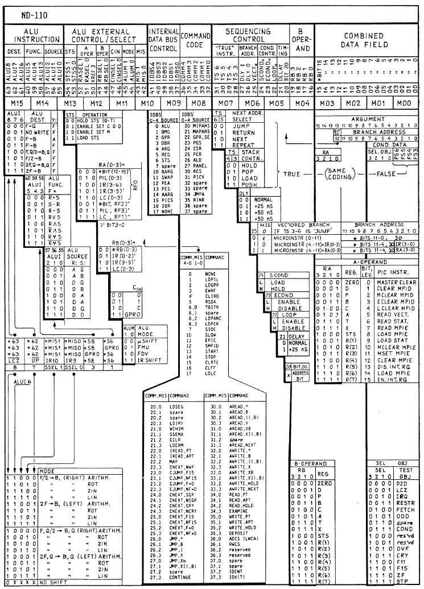
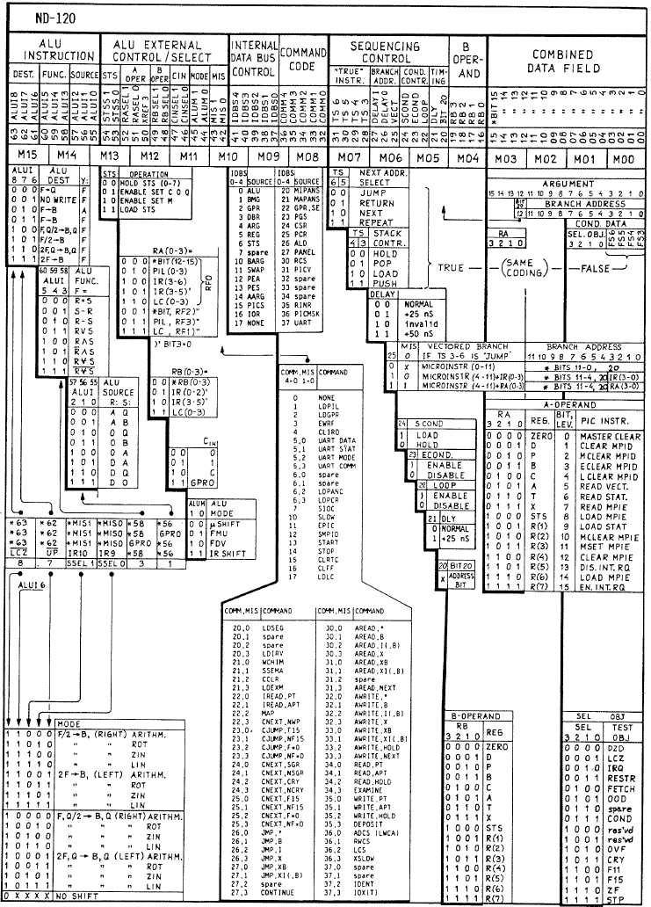

# nd100uc - ND-100/110/120 Microcode Toolchain

A complete toolchain for working with microcode from the Norsk Data
ND-100, ND-110, and ND-120 minicomputers. Web-based disassembler/viewer,
ROM combiners, and build pipeline.

The TypeScript library and YAML definitions live in the shared
[nd-microcode-meta](https://github.com/HackerCorpLabs/nd-microcode-meta)
submodule. The VSCode extension lives in a
[separate repo](https://github.com/HackerCorpLabs/vs-extension-nd110-uc).

**Live web viewer:** [hackercorplabs.github.io/nd100uc](https://hackercorplabs.github.io/nd100uc/)

## Status

| Component                        | Status      | Notes                                                            |
|----------------------------------|-------------|------------------------------------------------------------------|
| YAML canonical definitions       | done        | 299 ND-100, 357 ND-110, 358 ND-120 tokens, all field positions  |
| TypeScript disassembler          | done        | 3-line assembly format for all three models                      |
| TypeScript assembler             | done        | 100% bit-exact roundtrip on all tested ROMs                     |
| Round-trip (disasm -> reasm)     | done        | **100% bit-exact** on all five ROM images (see Validation)       |
| ND-100 PROM combiner            | done        | 16-chip 82S185 interleave + decode-PLA (Python)                 |
| ND-110/120 ROM combiner + CLI   | done        | 2-chip EPROM interleave with auto-detect (TypeScript)            |
| Web disassembler                 | done        | 3-line layout, opcode badges, clickable labels, all models       |
| GitHub Pages auto-deploy         | done        | Pushes to main auto-deploy the web viewer                       |
| VSCode extension                 | done        | [vs-extension-nd110-uc](https://github.com/HackerCorpLabs/vs-extension-nd110-uc) |

## Repository layout

| Path                                          | Description                                                  |
|-----------------------------------------------|--------------------------------------------------------------|
| `external/meta/`                              | Submodule: [nd-microcode-meta](https://github.com/HackerCorpLabs/nd-microcode-meta) |
| `external/meta/defs/`                         | YAML token/field definitions (source of truth)               |
| `external/meta/lib/ts/`                       | TypeScript library (`@nd100uc/microcode`)                    |
| `external/meta/reference/roms/`               | PROM/EPROM dumps for all three models                        |
| `external/meta/tools/nd100-combine.py`        | ND-100 multi-PROM combiner (Python)                          |
| `src/index.html`                              | Web app source                                               |
| `tools/web-build/build-web.mjs`               | Web build: combine ROMs, generate symbols, bundle JS         |
| `tools/web-build/generate-nd100-symbols.mjs`  | Generate ND-100 labels from decode-PLA                       |
| `tools/rom-combiner/`                         | `nd100uc-rom` CLI for ND-110/120 EPROM combine/split         |
| `microcode/`                                  | ND-110 RASK assembled source + binary                        |
| `.github/workflows/deploy-web.yml`            | GitHub Pages auto-deploy on push to main                     |

## Supported models

| Model  | Word size | Chips                         | XOR on load                                       |
|--------|-----------|-------------------------------|---------------------------------------------------|
| ND-100 | 64-bit    | 16 x 82S185 PROMs per bank   | `0x0F800000` (bits 23-27)                         |
| ND-110 | 64-bit    | 2 x 27256 EPROMs              | `0x0FC00000` (bits 22-27)                         |
| ND-120 | 64-bit    | 2 x 27C256 EPROMs             | None (canonical form)                             |

All three models use 64-bit microinstruction words.

### Hardware

| ND-100 | ND-110 | ND-120 |
|:---:|:---:|:---:|
|  |  |  |

## Building the web app

```bash
git clone --recurse-submodules https://github.com/HackerCorpLabs/nd100uc.git
cd nd100uc

# Build the TS library (in the submodule)
cd external/meta/lib/ts && npm ci && npm run build && cd ../../../..

# Build the web app
node tools/web-build/build-web.mjs

# Serve locally
cd web && python3 -m http.server 8765
```

The web app is also auto-deployed to GitHub Pages on every push to main.

## Web viewer features

- **3-line assembly layout** (Line 1: registers+ALU, Line 2: IDB+COMM+sequencing, Line 3: branch/condition)
- **All three models**: ND-100, ND-110, ND-120
- **Syntax-highlighted** tokens with hover tooltips from YAML descriptions
- **Clickable branch targets** and labels for navigation
- **Opcode badges** showing which macro-instructions dispatch to each microaddress (ND-100)
- **Alternating row backgrounds** to visually separate instructions

## Available ROM images

| Entry | Model | Records | Source |
|-------|-------|---------|--------|
| ND-110 RASK (K) | ND-110 | 4865 | Assembled from user-maintained source |
| ND-110 3095-L factory | ND-110 | 6879 | Combined from 37948L + 37949L EPROMs |
| ND-120 3202D 4MB | ND-120 | 8192 | Combined from 45132L + 45133L EPROMs |
| ND-120 3202D 6MB | ND-120 | 8192 | Combined from Frode's 6MB variant EPROMs |
| ND-100 3033S | ND-100 | 2048 | Combined from 16 82S185 PROMs |
| ND-100 3033E-CX base | ND-100 | 2008 | Combined from 16 82S185 PROMs |
| ND-100 3033E-CX ext | ND-100 | 1529 | Combined from 16 82S185 PROMs (uaddr 0o4000+) |

## Validation

| ROM | Model | Records | Roundtrip |
|-----|-------|---------|-----------|
| ND-110 RASK (assembled) | ND-110 | 4865 | **100%** bit-exact |
| ND-110 3095-L (factory) | ND-110 | 6879 | **100%** bit-exact |
| ND-120 3202D 4MB (factory) | ND-120 | 8192 | **100%** bit-exact |
| ND-100 3033S (factory) | ND-100 | 2048 | **100%** bit-exact |
| ND-100 3033E-CX (factory) | ND-100 | 2008 | **100%** bit-exact |

## Related repos

| Repo | Description |
|------|-------------|
| [nd-microcode-meta](https://github.com/HackerCorpLabs/nd-microcode-meta) | Shared submodule: YAML definitions, TS library, reference ROMs |
| [vs-extension-nd110-uc](https://github.com/HackerCorpLabs/vs-extension-nd110-uc) | VSCode extension for .uc files |

## License

MIT - see [LICENSE](LICENSE).
